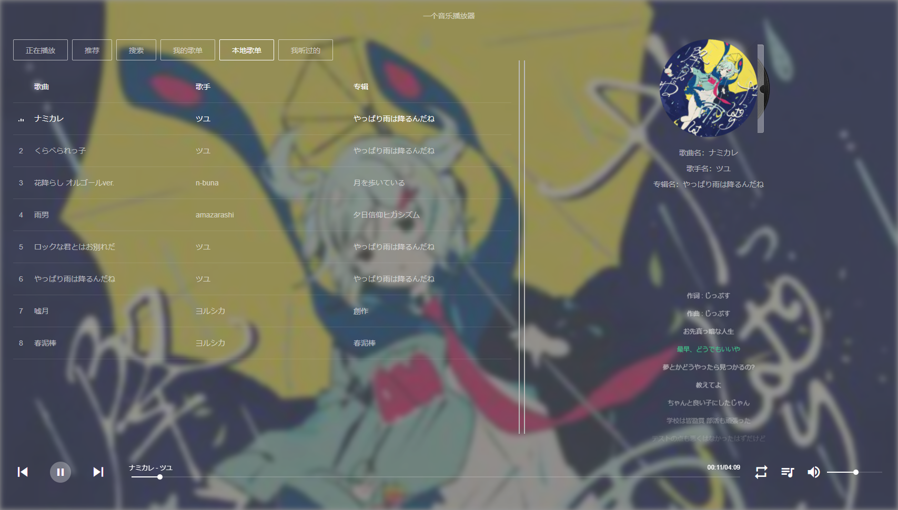

# vueplayer

A music player developed using Vue.js. This project is inspired by [maomao1996/Vue-mmPlayer](https://github.com/maomao1996/Vue-mmPlayer) and [Binaryify/NeteaseCloudMusicApi](https://github.com/Binaryify/NeteaseCloudMusicApi).

# Disclaimer

The audio files and their copyrights come from the interface of other websites. This porject only provides data query service and does not provide any audio storage and sales services.

This project is only for practice, please do not use it for any commercial purposes or download pirated audio resources through this porject.

# Usage

``` sh
git clone git@github.com:Beniko95J/a-player.git

cd a-player

# front-end
npm install

npm run serve

# back-end for local info, make sure you have installed MongoDB
cd server

npm install

npm run serve
```

# TODO List

- [ ] More play modes
- [ ] Fetch user playlist
- [ ] History playlist
- [ ] Fetch comment list
- [ ] ...

# Screenshot


